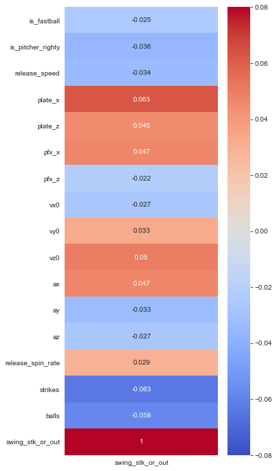
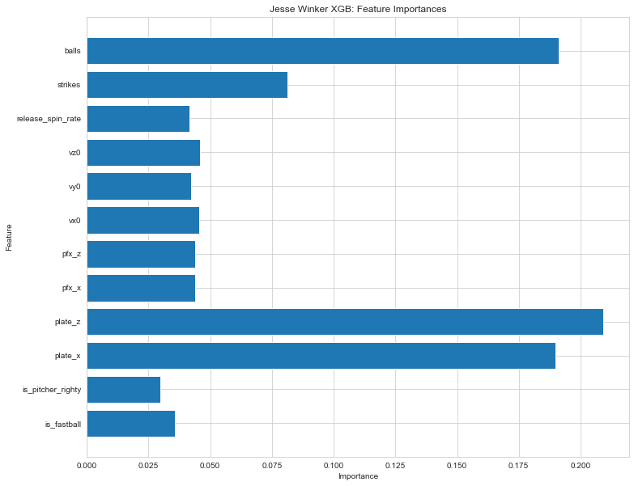
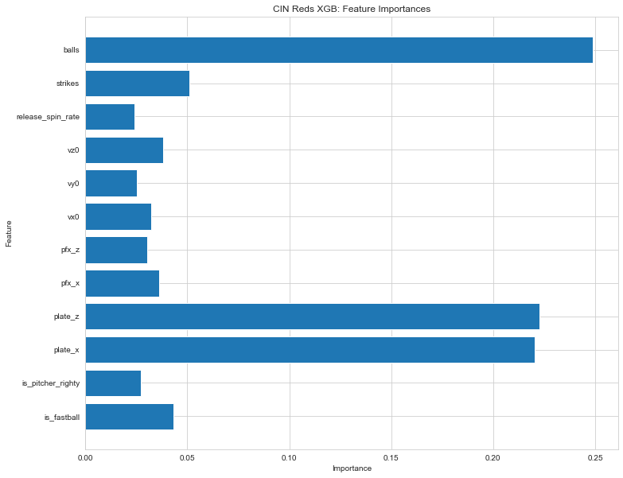

# MLB Pitch Outcome Classification Capstone

**Author**: [Eric Wehmueller](mailto:ericwehmueller@gmail.com)

## Overview

This project is the final/Capstone project for Flatiron School's bootcamp program in Data Science.  We have created a hypothetical situation as a Data Scientist and are hoping to provide value to our business for the scenario.

## Business Problem

We have been hired as a hypothetical member of the Cardinals baseball organization: a member of the coaching staff.  As a coaching analyst, our job is to create a model that will give us insights into pitch quality and classify a pitch, given its metrics, as a negative, neutral, or positive outcome for the pitcher.

## Project Deliverables

* A GitHub repository
* A Jupyter Notebook
* A non-technical presentation


## Project Summary

I devised these questions that I believed could be answered through data analysis.
***
* 1. What are the most important metrics that go into a pitch?
* 2. What is the least important metric that goes into a pitch?
***

I explore this thoroughly in the pitch-classification.ipynb file contained within this repository via classification modeling.
I progressively alter the scope of the models as I iterate over different options.  Here are some visualization previews of the data I investigated.

## Corr Heatmap Between Features and Pitch Outcome


## Single Player XGB Model Feature Importances


## Entire Team XGB Model Feature Importances


## Repository Structure

```
├── data
├── README.md
├── lol_presentation.pdf
├── lol_notebook.pdf
└── league-analysis.ipynb
```